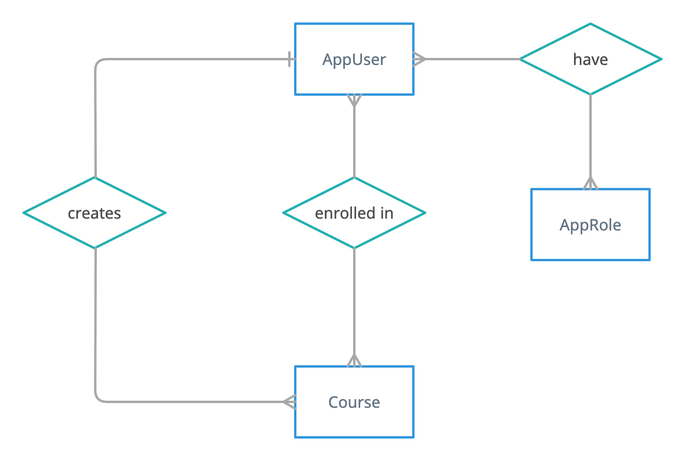

# Spring Security

## What is Spring Security?
Application security boils down to two more or less independent problems: Authentication (Who are you?) and Authorization (What are you allowed to do?). Spring Security is a framework that provides authentication, authorization and protection against common attacks, and it is the de-facto standard for securing Spring-based applications.

## About Course
This course offers a step-by-step guide to securing the REST APIs by introducing some of the most commonly used concepts in Spring Security. This course assumes you have basic knowledge of Spring Boot and REST APIs.

## Course Management System
The course management system is a Spring Boot application having a collection of REST APIs to manage courses, students and instructors. The actors who can interact with these APIs are

- Students
- Instructors
- Admin

It uses Spring Data JPA to persist data in MySQL database. Below is the simple Entity-Relationship diagram of the application.

## Objective
At the moment, all the REST APIs are accessible to everyone. Our objective is to secure each of them from unauthorized users, as expected below.

| API | Objective |
|--|--|
| List Courses | Any user can browse through the list of available courses |
| Get Course | Any user can view the details of a course |
| Create Course | Instructors can only create a new course |
| Update Course | Instructor who created the course can only update it |
| Play Course | Students who are enrolled on the course can only play it |
| List Students | Admin can only view the list of students |
| List Instructors | Admin can only view the list of instructors |
| View User Profile | Users can only view their profile; however, any user can view an Instructor's profile |

## Guidelines

- Checkout the code from GitHub.
- Edit your database details in `src/main/resources/application.properties`.
- Build and Run the application in IDE of your choice.
- Running the application will automatically create (or update) the database entities and a few sample records.
- Understanding the business logic of each REST API is not required.
- Make yourself familiar with the below users and their roles created by default in order to test the security implementation.

| Roles | Users |
|--|--|
| Student (3) | Bob, Kevin, Stuart |
| Instructor (2) | Gru, Lucy |
| Admin (1) | Admin |

***

Next: [02. Add Spring Security](https://github.com/SankaranarayananMurugan/spring-security-guide/tree/main/02.%20Add%20Spring%20Security)