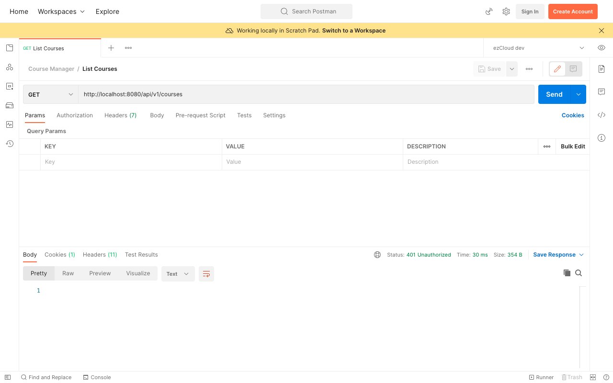
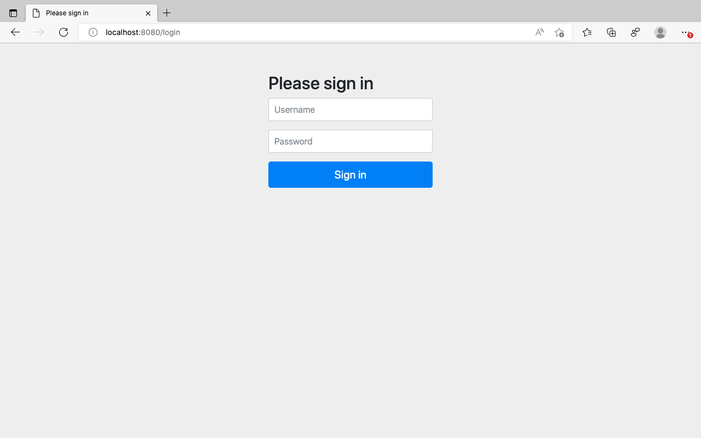
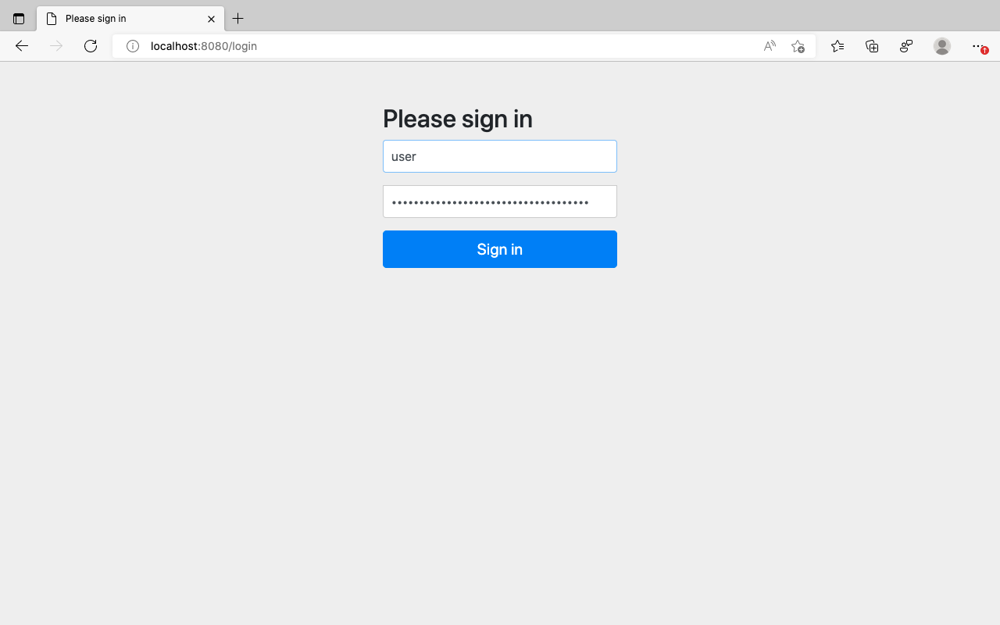
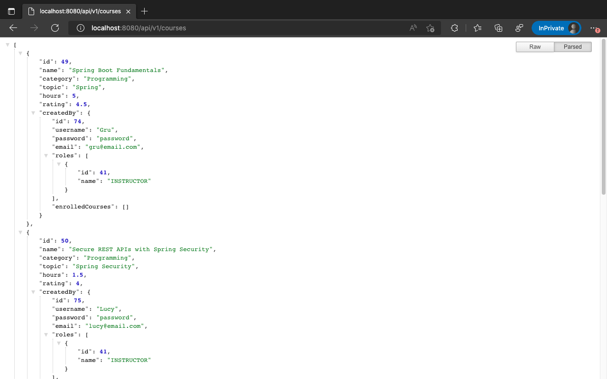
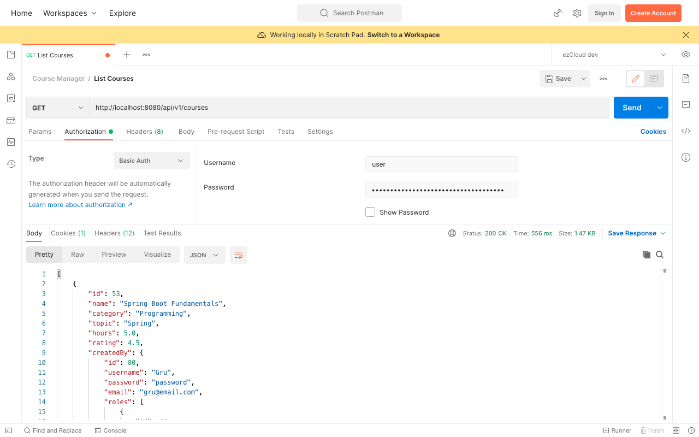

# Add Spring Security

Let’s start adding Spring Security to the application to secure all the REST APIs, which are now accessible to everyone. Add `spring-boot-starter-security` dependency to the `pom.xml` as below:
```xml  
<dependency>
	<groupId>org.springframework.boot</groupId>    
	<artifactId>spring-boot-starter-security</artifactId>
</dependency>  
```  
Accessing the [List Courses](http://localhost:8080/api/v1/courses) API from Postman results in *401 Unauthorized* error.



Accessing the same API in browser redirects us to the below [Login](http://localhost:8080/login) page.



Spring Security enables default behaviours to the application, where all the resources (incl. static resources) are secured by default. It expects the user to authenticate himself with *username* and *password* to access any resources. It also automatically creates an in-memory user named ***user***.

One can notice something similar to the below lines in the application startup log, where a random password is generated for this in-memory user.

```log
Using generated security password: fdea9fea-3b53-43f8-b78b-046ca27b03af  
  
This generated password is for development use only. Your security configuration must be updated before running your application in production.  
```  

Logging in with ***user*** as username and this ***random password*** as password in the browser authenticates successfully and responds with the list of courses.





Similarly accessing the API in Postman with user and the same random password using Basic Authentication as Authorization mechanism responds successfully with the list of courses.



By default, Spring Security enables **Basic Authentication** for all resources in addition to creating an in-memory user. It chooses appropriate EntryPoint as well to respond when authentication fails.

In this case, it chooses `org.springframework.security.web.authentication.www.BasicAuthenticationEntryPoint` to respond with *401 Unauthorized* error status in Postman. And it chooses `org.springframework.security.web.authentication.LoginUrlAuthenticationEntryPoint` to respond with *302 Found redirect* error status in the browser to redirect to login page.


***

Previous: [01. Introduction](https://github.com/SankaranarayananMurugan/spring-security-guide/tree/main/01.%20Introduction)

Next: [03. Enable Basic Authentication](https://github.com/SankaranarayananMurugan/spring-security-guide/tree/main/03.%20Enable%20Basic%20Authentication)