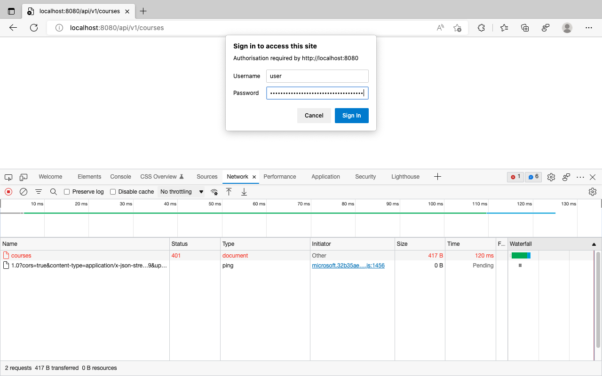
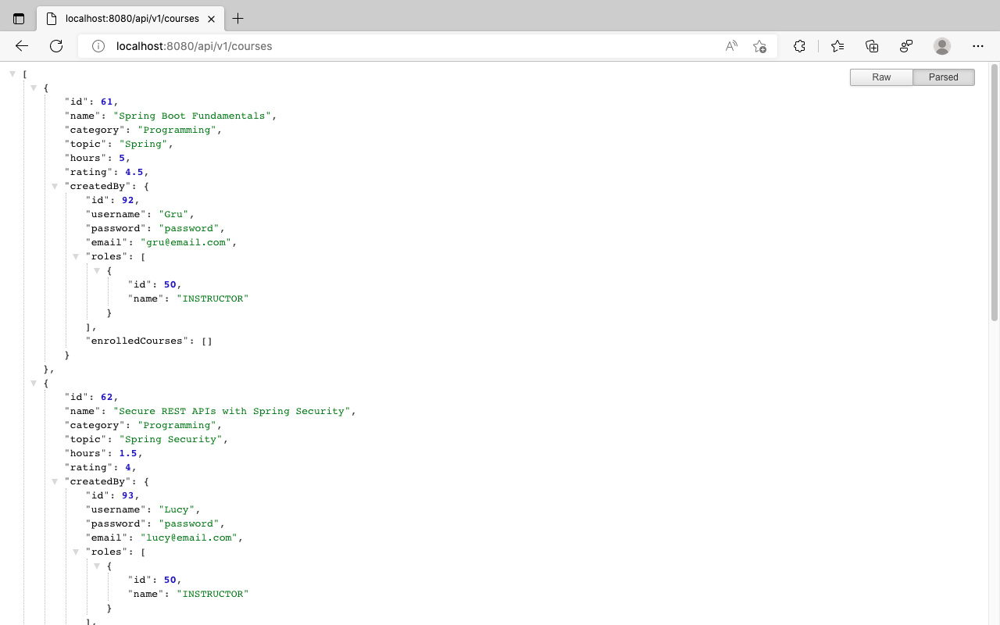

# Enable Basic Authentication

## What is Basic Auth(entication)?

Basic Auth is an authentication mechanism for any HTTP user agents like browser or REST clients like Postman to provide username and password when making a request. It is stateless where each request must contain Authorization header with value in the format `Basic <Credentials>`, where Credentials is the base64 encoding of username and password joined by a single colon (username:password).

## Configure HttpSecurity

Let's override the default Spring Security behaviour by configuring `HttpSecurity` and creating a `SecurityFilterChain` bean in a `@Configuration` class. `WebSecurityConfigurerAdapter` earlier used to configure `HttpSecurity` was deprecated in Spring Security-5.7.0-M2.

```java
@Configuration
public class SecurityConfig {
	  @Bean
	  public SecurityFilterChain apiFilterChain(HttpSecurity http) throws Exception {
			http
					.authorizeRequests(auth -> auth
							.anyRequest().authenticated()
					)
					.httpBasic();
			return http.build();
	  }
}
```

This `SecurityFilterChain` tells Spring Security to authenticate any request with Basic Auth. It might sound like the default behaviour we saw earlier. But configuring `HttpSecurity` explicitly with `httpBasic()` also tells Spring Security to choose  `org.springframework.security.web.authentication.www.BasicAuthenticationEntryPoint` as the default EntryPoint.

Accessing the [List Courses](http://localhost:8080/api/v1/courses) API from browser now responds with *401 Unauthorised* instead of *302 Found redirect* error status. It will enable the browser to prompt for username and password rather than redirecting to login page. Providing the username as user and the random password responds with the list of courses as expected.





***

Previous: [02. Add Spring Security](https://github.com/SankaranarayananMurugan/spring-security-guide/tree/main/02.%20Add%20Spring%20Security)

Next: [04. Permit Public APIs](https://github.com/SankaranarayananMurugan/spring-security-guide/tree/main/04.%20Permit%20Public%20APIs)