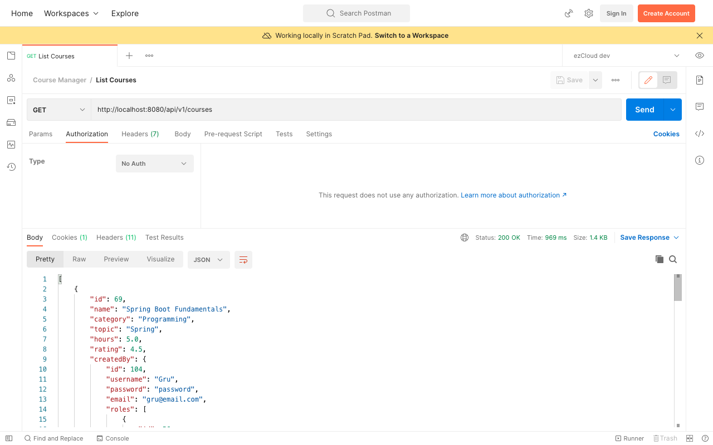

# Permit Public APIs

The default Spring Security behaviour secured all the REST APIs with Basic Auth. Configuring `HttpSecurity` to override this default behaviour also did the same. In both scenarios, the REST API consumer has to provide *username* and *password* for authentication, failing to provide them resulted in *401 Unauthorized* error.

However, [List Courses](http://localhost:8080/api/v1/courses) and [Get Course](http://localhost:8080/api/v1/courses/%7BcourseId%7D) are Public APIs that should be accessible to everyone without authentication. Let's update `HttpSecurity` configuration to permit these Public APIs for everyone.

Add the Public API urls in a constant class as below:
```
public class SecurityConstants {  
	public static final String API_LIST_COURSES = "/api/v1/courses";  
	public static final String API_GET_COURSE = "/api/v1/courses/*";  
  
	public static final String[] PUBLIC_API_LIST = new String[] {  
		API_LIST_COURSES,  
		API_GET_COURSE
	};  
}
```

Update `HttpSecurity` configuration with one of the antMatchers overloaded method: `antMatchers(HttpMethod, String...)`

```
http  
        .authorizeRequests(auth -> auth  
                .antMatchers(GET, PUBLIC_API_LIST).permitAll()  
                .anyRequest().authenticated()  
        )  
        .httpBasic();
```

Now accessing the two Public APIs in Postman without *username* and *password* by selecting No Auth option in the Authorization tab responds with `200 OK` status.



Because List Courses and Create Course endpoints are the same but with different HttpMethod, we have to  specify `HttpMethod.GET` in the antMatchers to permit only the List Courses API.

The order in which the antMatchers are defined is important, with most restricted resources defined at the top followed by least restricted resources at the bottom.