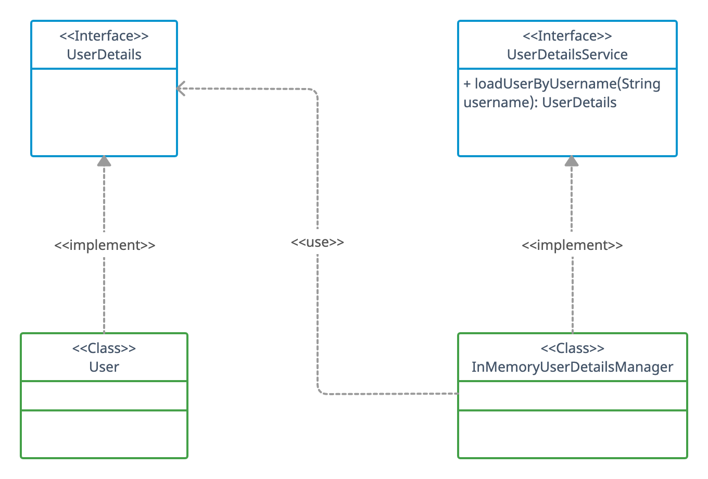
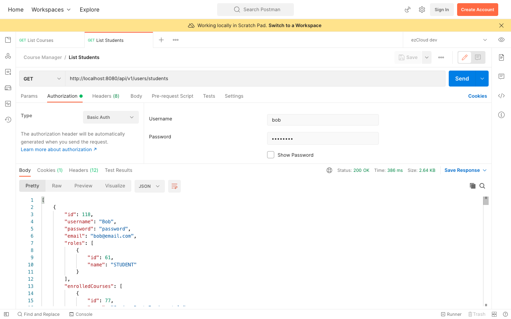

# Authentication with AppUser

We have used the default user created by Spring Security so far. It’s time to provide Spring Security with the application’s user details from the database.

## Fetch UserDetails

Fetch all the `AppUser` records from the database and map them with one of the `org.springframework.security.core.userdetails.UserDetails` implementations.

Here we map the *username* and *password* from `AppUser` with the same variables in `org.springframework.security.core.userdetails.User` using the Builder method. Let's keep the authorities with `Collections.EMPTY_SET` for now as it can't be null.

```java
@Service
public class DbUserDetailsService {    
    @Autowired    
    private AppUserRepository appUserRepository;    
    
    public List<UserDetails> getAllUserDetails() {    
        return appUserRepository.findAll()    
                .stream()    
                .map(appUser -> User.builder()    
                        .username(appUser.getUsername())    
                        .password(String.format("{noop}%s", appUser.getPassword()))    
                        .authorities(Collections.EMPTY_SET)    
                        .build()    
                )    
                .collect(Collectors.toList());    
    }  
}  
```  

We must create a `PasswordEncoder` bean and use it to encode the password for UserDetails. We will see this in action in the next chapter. Alternatively, we can prefix the password with an appropriate string literal to specify the PasswordEncoder being used to encode it.

As passwords in the database are not encrypted, we prefix them with the string literal `{noop}`. This prefix tells Spring Security to use `NoOpPasswordEncoder` to match the password on authenticating the user.

## InMemoryUserDetailsManager Bean

Spring Security uses the `org.springframework.security.core.userdetails.UserDetailsService` interface to retrieve user-related data. We can customize the logic to retrieve user information by overriding *loadUserByUsername()* in a class implementing `UserDetailsService` interface.

Below class diagram represents the relationship between some of the classes discussed in this chapter.



Let's create an `InMemoryUserDetailsManager` bean, one of the few implementations of `UserDetailsService` interface offered by Spring Security. It accepts a list of `UserDetails` objects to manage the user-related data for authentication.

```java
@Configuration  
public class SecurityBean {  
	@Autowired  
	private DbUserDetailsService dbUserDetailsService;  
  
	@Bean  
	public UserDetailsService userDetailsService() {  
		return new InMemoryUserDetailsManager(  
		        dbUserDetailsService.getAllUserDetails()  
		); 
	}  
}
```

## Test Authentication with AppUser

Spring Security neither creates the default user nor generates the random password anymore. It uses `InMemoryUserDetailsManager` bean to hold the list of `UserDetails` mapped from the `AppUser` records in database.

We can use any of these AppUser from the database to authenticate the secured REST APIs. Let's use Bob (the STUDENT user) to access the [List Students](http://localhost:8080/api/v1/users/students) API in Postman using Basic Auth.


