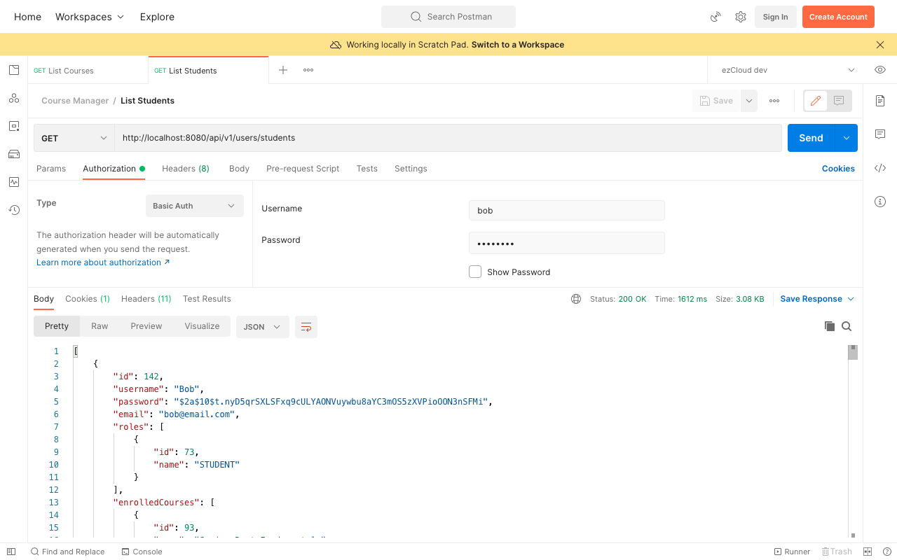
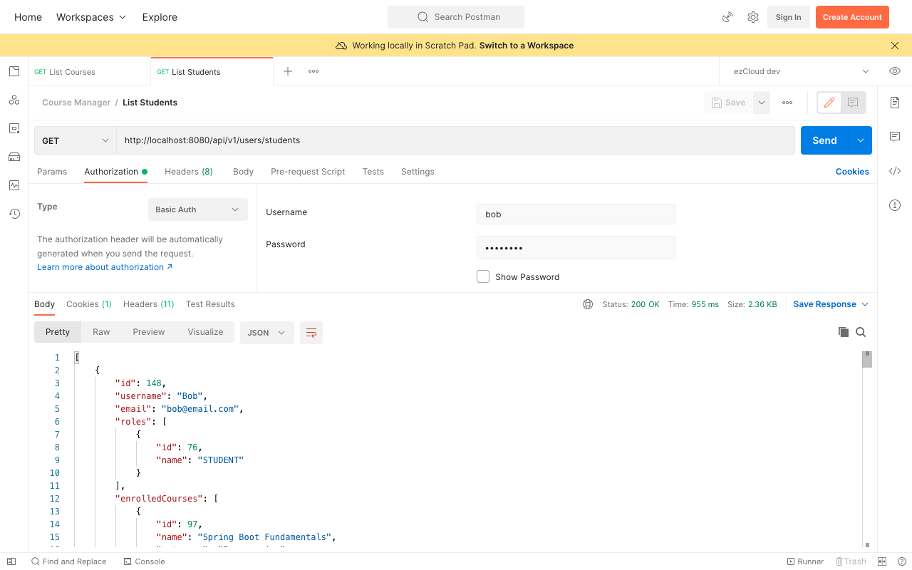

# Password Encoder

You may notice from the [List Students](http://localhost:8080/api/v1/users/students) response that the passwords in the database are not encrypted for any users. In this chapter, we will introduce the most commonly used `BCryptPasswordEncoder` offered by Spring Security.

## BCryptPasswordEncoder

`BCryptPasswordEncoder` is one of the few implementations of the `PasswordEncoder` interface. It helps us to *encode* the password as well as *match* the raw password with the encoded password on authentication.

Let's create a `BCryptPasswordEncoder` bean in the `SecurityBean` class.

```java
@Bean  
public PasswordEncoder passwordEncoder() {  
    return new BCryptPasswordEncoder();  
}
```

Autowire the `PasswordEncoder` in `AppDataInitialiser`, and use it to encode the password for all the users before saving it in the database.

```java
AppUser gruUser = AppUser.builder()  
        .username("Gru")  
        .password(passwordEncoder.encode("password"))  
        .email("gru@email.com")  
        .roles(Collections.singleton(instructorRole))  
        .build();
```

Restarting the application triggers `AppDataInitialiser` to clear the database and recreate all the user records with encrypted passwords.

As Spring Security is now aware of the `PasswordEncoder` bean available in the ApplicationContext, *encoded password* can be mapped directly from `AppUser` to `UserDetails` without specifying any prefix like `{noop}` or `{bcrypt}`

```java
public List<UserDetails> getAllUserDetails() {  
    return appUserRepository.findAll()  
            .stream()  
            .map(appUser -> User.builder()  
                    .username(appUser.getUsername())  
                    .password(appUser.getPassword())  
                    .authorities(Collections.EMPTY_SET)  
                    .build()  
            )  
            .collect(Collectors.toList());  
}
```

Let's restart the application and use Bob (the STUDENT user) to access the [List Students](http://localhost:8080/api/v1/users/students) API from Postman.



As you can see from the response that the passwords in the database are now encrypted. But still it is not good to see the passwords in the response though encrypted. We can annotate the *password* field in `AppUser` entity with `@JsonIgnore` annotation to ignore it.



***

Previous: [05. Authentication with AppUser](https://github.com/SankaranarayananMurugan/spring-security-guide/tree/main/05.%20Authentication%20with%20AppUser)

Next: [07. Role Based Authorization](https://github.com/SankaranarayananMurugan/spring-security-guide/tree/main/07.%20Role%20Based%20Authorization)