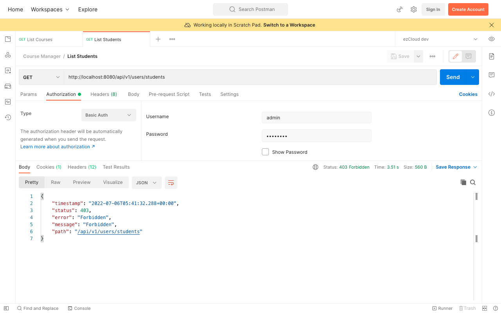
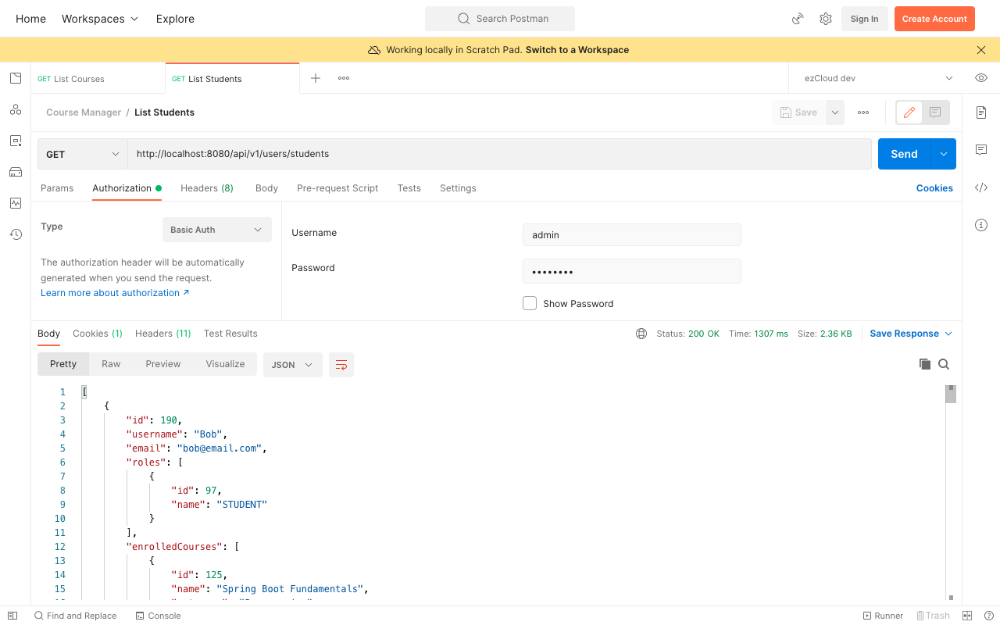

# Role Based Authorization

In the last two chapters, we accessed one of the Admin APIs ([List Students](http://localhost:8080/api/v1/users/students)) using Bob, whose role is a Student. In this chapter, we will fix it by securing the below APIs using Role-based authorization.

|API|Authorization|
|--|--|
| List Students | Admin can only view the list of students |
| List Students | Admin can only view the list of students |
| Create Course | Instructors can only create a new course |

Add the above API urls in the `SecurityConstants` class as below:

```java
public static final String API_LIST_STUDENTS = "/api/v1/users/students";  
public static final String API_LIST_INSTRUCTORS = "/api/v1/users/instructors";
public static final String API_CREATE_COURSES = "/api/v1/courses";
```

Update `HttpSecurity` configuration with above API urls in `antMatchers()` and secure them with appropriate RoleEnum instances using `hasRole()` as below:

```java
http.authorizeRequests(auth -> auth  
		.antMatchers(GET, PUBLIC_API_LIST).permitAll()  
		.antMatchers(API_LIST_STUDENTS, API_LIST_INSTRUCTORS).hasRole(ADMIN.name())  
		.antMatchers(POST, API_CREATE_COURSES).hasRole(INSTRUCTOR.name())  
		.anyRequest().authenticated()  
	)  
	.httpBasic();
```

Similar to what we did in [Permit Public API](https://github.com/SankaranarayananMurugan/spring-security-guide/tree/main/04.%20Permit%20Public%20APIs), we have to specify `HttpMethod` as `POST` for *Create Course* API, as it shares the same url with *List Courses* API

Accessing the [List Students](http://localhost:8080/api/v1/users/students) API now using Admin (Admin user) will return us `403 Forbidden` error status. Though we have secured this API for Admin, Spring Security has no idea who the Admin is, as we have only provided *username* and *password* for all the UserDetails.



Let's map the roles from `AppUser` to `UserDetails` as below:

```java
appUserRepository.findAll()  
		.stream()  
		.map(appUser -> User.builder()  
		        .username(appUser.getUsername())  
		        .password(appUser.getPassword())  
		        .authorities(Collections.EMPTY_SET)  
		        .roles(this.getRoles(appUser.getRoles()))
		        .build()  
		)  
		.collect(Collectors.toList());
```

```java
private String[] getRoles(Set<AppRole> roles) {  
	return roles.stream()
	        .map(role -> role.getName().name())
	        .collect(Collectors.toSet())
	        .toArray(new String[0]);
}
```

> `roles()` is an overloaded method, here we chose the one which accepts `String[]`.

Restart the application and access the [List Students](http://localhost:8080/api/v1/users/students) API now using Admin (Admin user) to see the list of students as response, whereas `403 Forbidden` for Bob (Student).




> **Note:**
> [roles()](https://docs.spring.io/spring-security/site/docs/current/api/org/springframework/security/core/userdetails/User.UserBuilder.html#roles%28java.lang.String...%29) and [authorities()](https://docs.spring.io/spring-security/site/docs/current/api/org/springframework/security/core/userdetails/User.UserBuilder.html#authorities%28java.lang.String...%29) both populates the authorities in [User](https://docs.spring.io/spring-security/site/docs/current/api/org/springframework/security/core/userdetails/User.html) class, as it has no roles attribute. But `roles()` automatically prefixes each entry with `ROLE_`. This means  `builder.roles("ADMIN");` is equivalent to `builder.authorities("ROLE_ADMIN");`.
>
> Here we're calling `roles()` after `authorities()` in order to override the `Collections.EMPTY_SET`, that means we should never call them both on `User.UserBuilder` as the latest will always override the authorities set by the previous one.
>
> In those scenarios, where you want to set both roles and authorities, it is always preferable to call `authorities()` with roles explicitly prefixed with **ROLE_** by yourself, as we will see in the upcoming chapters.