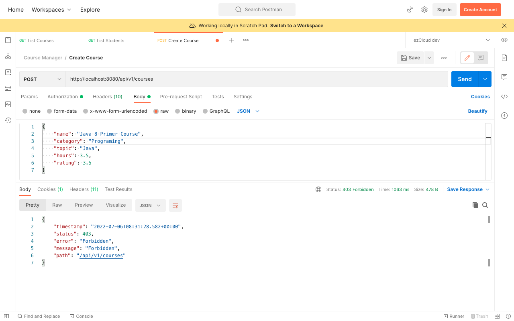
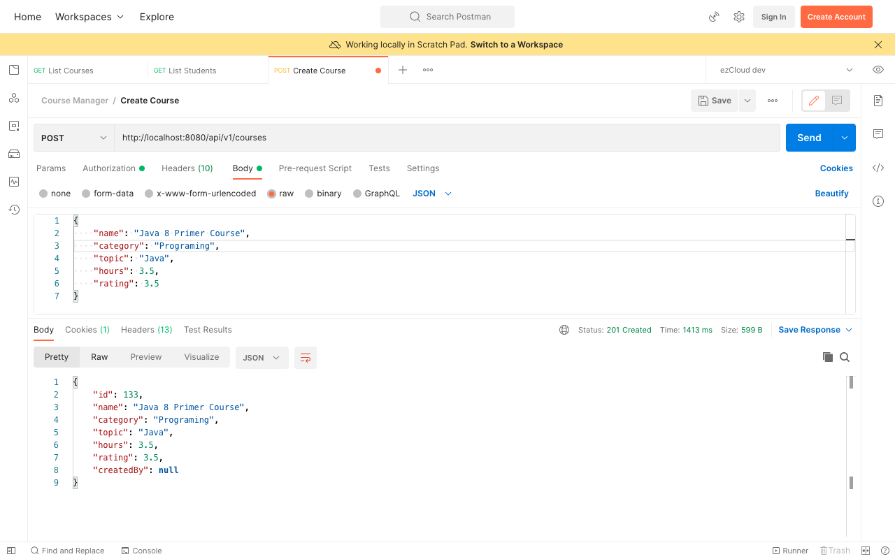

# Disable CSRF

Let's create a new course using [Create Course](http://localhost:8080/api/v1/courses) API with the user Gru (Instructor), as we have already secured the API for the Instructor role in the previous chapter.



We got `403 Forbidden` error even with the user having the right role. Let's update the `application.properties` to enable the `DEBUG` log for Spring Security.

```
logging.level.org.springframework.security=DEBUG
```

Restart the application and send the [Create Course](http://localhost:8080/api/v1/courses) API request again. You can see `Invalid CSRF token found for http://localhost:8080/api/v1/courses` error in the log something similar like below:

```
o.s.security.web.FilterChainProxy        : Securing POST /api/v1/courses
w.c.HttpSessionSecurityContextRepository : Retrieved SecurityContextImpl [...]
s.s.w.c.SecurityContextPersistenceFilter : Set SecurityContextHolder to SecurityContextImpl [...]
o.s.security.web.csrf.CsrfFilter         : Invalid CSRF token found for http://localhost:8080/api/v1/courses
o.s.s.w.access.AccessDeniedHandlerImpl   : Responding with 403 status code
s.s.w.c.SecurityContextPersistenceFilter : Cleared SecurityContextHolder to complete request
o.s.security.web.FilterChainProxy        : Securing POST /error
w.c.HttpSessionSecurityContextRepository : Retrieved SecurityContextImpl [...]
s.s.w.c.SecurityContextPersistenceFilter : Set SecurityContextHolder to SecurityContextImpl [...]
o.s.s.w.a.i.FilterSecurityInterceptor    : Authorized filter invocation [POST /error] with attributes [authenticated]
o.s.security.web.FilterChainProxy        : Secured POST /error
s.s.w.c.SecurityContextPersistenceFilter : Cleared SecurityContextHolder to complete request
```

## What is CSRF and CSRF Token?

Cross-Site Request Forgery (CSRF) is an attack that forces authenticated users to submit a request to a Web application in which they are currently authenticated.

Assume you are browsing through an evil website, while still logged in with your Banks' website. The evil website can force you to click an image, link or button, which then can send an unsolicited fund transfer request to your Bank's website from the evil website. Though the evil website can not see your cookies, the cookies associated with your Bank's website are still sent along with your request. And you Bank's website in no way can differentiate this malicious request, it executes the requested fund transfer.

CSRF attacks can be prevented using CSRF token, a secure random token unique per user session known only to the application and it's user interface.

## When to use CSRF protection

CSRF protection is enabled by default in Spring Security for those `HttpMethod` which potentially can change the state of the application: POST, PUT, DELETE and/or PATCH.

Spring Security recommends to use CSRF protection for any request that could be processed by a browser by normal users. If you are only creating a service that is used by non-browser clients, you will likely want to disable CSRF protection.

## Disable CSRF protection

For the purpose of our course, let's go with disabling CSRF by updating `HttpSecurity` configuration as below:

```
http
	.csrf().disable()  
	.authorizeRequests(auth -> auth  
	        .antMatchers(GET, PUBLIC_API_LIST).permitAll()  
	        .antMatchers(API_LIST_STUDENTS, API_LIST_INSTRUCTORS).hasRole(ADMIN.name())  
	        .antMatchers(POST, API_CREATE_COURSES).hasRole(INSTRUCTOR.name())  
	        .anyRequest().authenticated()  
	)  
	.httpBasic();
```

Restart the application and send the [Create Course](http://localhost:8080/api/v1/courses) request again. You can see a below message somewhere in the log, where Spring Security authorizes the Instructor request and creates the new course. It throws `403 Forbidden` error for the users having roles other than Instructor.

`Authorized filter invocation [POST /api/v1/courses] with attributes [hasRole('ROLE_INSTRUCTOR')]`

