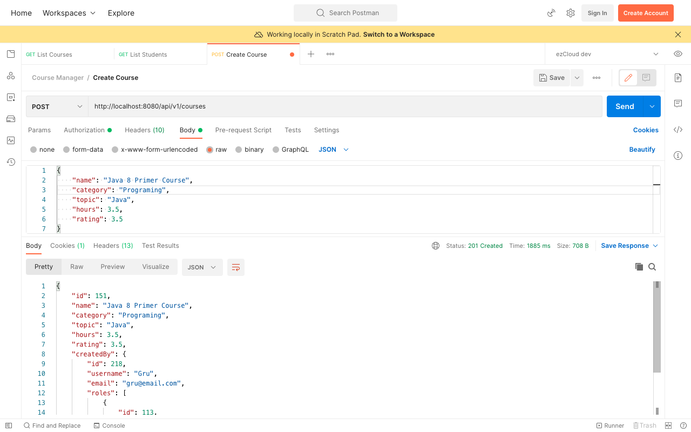

# Current Authenticated User

In the last chapter, you may notice the value for *createdBy* field is *null* in the newly created Course object. Of course, we did not send the user details in the request body for the *createdBy* field. But it is obvious to expect the Instructor (Gru) who sent the Create Course request to get mapped in the createdBy field.

Remember we sent the encoded *username* and *password* in the *Authorization* header for every request. And Spring Security authenticated and authorized the user before passing on the request to create the new course. While doing so, Spring Security holds the authenticated user details in a thread-local `SecurityContext` through out the request.

Create a Facade component to get the `Authentication` object from `SecurityContextHolder`.

```java
@Component  
public class AuthenticationFacade {  
	public Authentication getAuthentication() {  
	    return SecurityContextHolder.getContext().getAuthentication();  
	}  
}
```

Grab the name of the authenticated user from the `Authentication` object. This will be the *username* we set in the UserDetails object for each user. As the type of `createdBy` field is `AppUser`, we have to find the `AppUser` record by username.

Let's define `findByUsername()` method in `AppUserRepository` interface.

```java
@Repository  
public interface AppUserRepository extends JpaRepository<AppUser, Long> {  
	AppUser findByUsername(String username);
}
```

Add a method in `UserService` to get the `AppUser` object by *username* using the `@Autowired` `AppUserRepository` interface.

```java
public AppUser get(String username) {  
	return appUserRepository.findByUsername(username);
}
```

Let's wire all the pieces above in `CourseService.create(Course)`, to update `createdBy` field with the `AppUser` object before saving the new Course object.

```java
public Course create(Course newCourse) {  
	String username = authenticationFacade.getAuthentication().getName();  
	AppUser currentUser = userService.get(username);  
	newCourse.setCreatedBy(currentUser);  
	return courseRepo.save(newCourse);  
}
```

Restart the application and send a new Create Course request as an Instructor (Gru)



***

Previous: [08. Disable CSRF](https://github.com/SankaranarayananMurugan/spring-security-guide/tree/main/08.%20Disable%20CSRF)

Next: [10. Permission Based Access - Secure the APIs](https://github.com/SankaranarayananMurugan/spring-security-guide/tree/main/10.%20Permission%20Based%20Access%20-%20Secure%20the%20APIs)