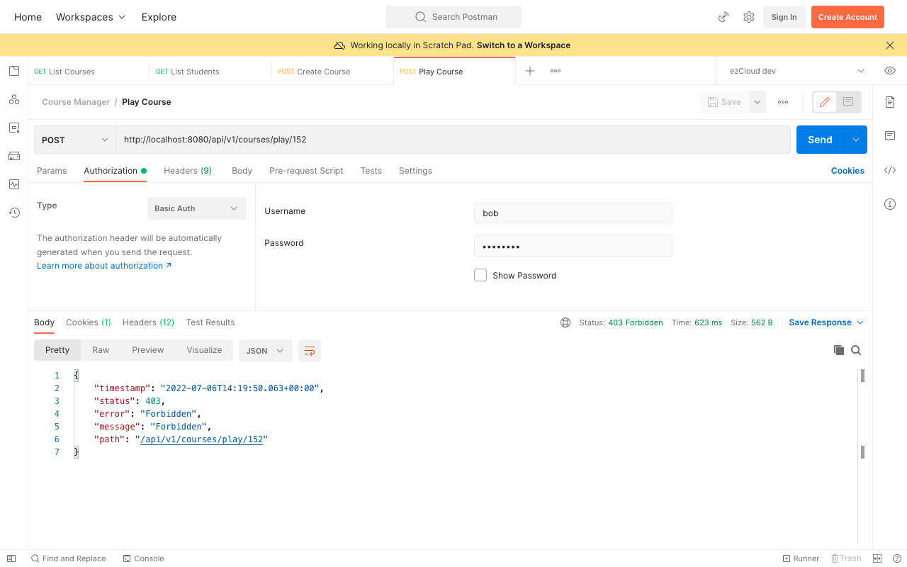

# Permission Based Access - Secure the APIs

We're yet to secure three more APIs, let's apply the Permission based access concept to secure [Play Course](http://localhost:8080/api/v1/courses/play/%7BcourseId%7D) API. We will gradually build this concept in four chapters

1. Secure the Play Course API based on permission.
2. Create Permission entity and define its relation with Role.
3. Update `UserDetails` authorities with the Permissions associated with each Role.
4. Change the Role-based secure APIs to Permission-based.

Create a `PermissionEnum` with instances named in the format `ACTION_RESOURCENAME`. Create them for all the resources to be secured, though we're going to only secure the Play Course API in this series.

```
public enum PermissionEnum {  
    CREATE_COURSE,
    UPDATE_COURSE,
    PLAY_COURSE,
    LIST_STUDENTS,
    LIST_INSTRUCTORS,
    VIEW_PROFILE
}
```

Add all the other API URLs in the `SecurityConstant` class.

```
public static final String API_UPDATE_COURSES = "/api/v1/courses/*";
public static final String API_PLAY_COURSE = "/api/v1/courses/play/*";
public static final String API_VIEW_PROFILE = "/api/v1/users/*";
```

Update `HttpSecurity` configuration with `API_PLAY_COURSE` url in `antMatchers()` and secure it with `PLAY_COURSE` PermissionEnum using `hasAuthority()`

```
http
    .csrf().disable()  
    .authorizeRequests(auth -> auth  
            .antMatchers(GET, PUBLIC_API_LIST).permitAll()  
            .antMatchers(API_LIST_STUDENTS, API_LIST_INSTRUCTORS).hasRole(ADMIN.name())  
            .antMatchers(POST, API_CREATE_COURSES).hasRole(INSTRUCTOR.name())  
            .antMatchers(API_PLAY_COURSE).hasAuthority(PLAY_COURSE.name())  
            .anyRequest().authenticated()  
    )  
    .httpBasic();
```

We can expect `403 Forbidden` error on sending a request to Play Course endpoint as a Student user (say, Bob), as we have neither assigned any Permissions to the Roles nor updated the authorities in `UserDetails`.


