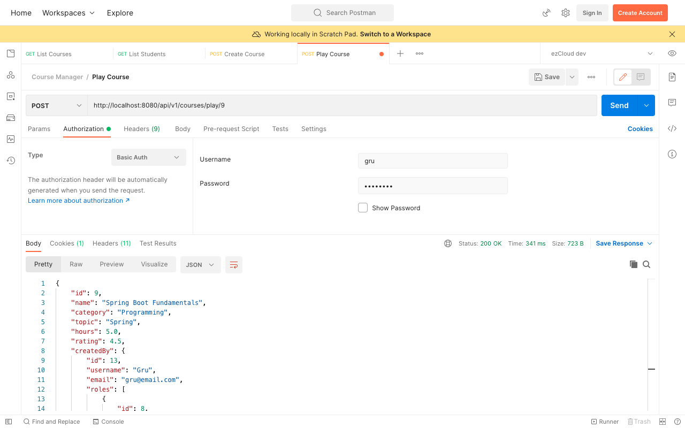
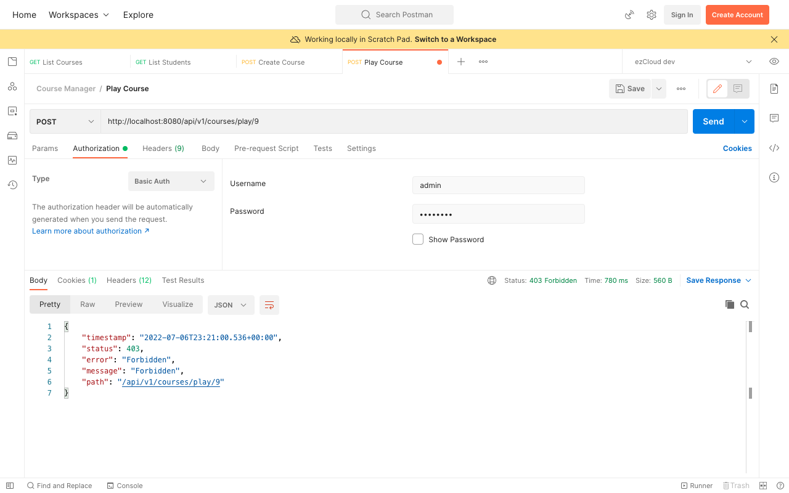

# Permission Based Access - Authorities with Permissions

In this chapter, we will update the `UserDetails` object with the Permissions associated with each role using `authorities()`.

One user can have many roles and each role can have many permissions. So let's add below private method to combine all the permissions associated with each roles assigned to the user.

```java
private Set<String> getPermissions(Set<AppRole> roles) {  
    return roles.stream()  
            .flatMap(role -> role.getPermissions().stream())  
            .map(permission -> permission.getName().name())  
            .collect(Collectors.toSet());  
}
```

Remember List Courses, Get Course and Create Course APIs are secured using `hasRole()`. And here, Play Course API is secured using `hasAuthority()`. So we have to update `UserDetails` object with both roles and permissions for each user.

As mentioned in [Chapter 7](https://github.com/SankaranarayananMurugan/spring-security-guide/tree/main/07.%20Role%20Based%20Authorization), we can not use both `roles()` and `authorities()` on `User.UserBuilder`. We will use only `authorities()` by combining roles (prefixed with **ROLE_**) and permissions.

Let's update the existing `getRoles()` to append the prefix *ROLE_* with the role name as below:

```java
private Set<String> getRoles(Set<AppRole> roles) {  
    return roles.stream()  
            .map(role -> String.format("ROLE_%s", role.getName().name()))  
            .collect(Collectors.toSet());  
}
```

We can remove the `roles()` method from `User.builder()`, and use only authorities with the roles and permissions combined as below:

```java
appUserRepository.findAll()  
        .stream()  
        .map(appUser -> User.builder()  
                .username(appUser.getUsername())  
                .password(appUser.getPassword())  
                .authorities(this.getRolesAndPermissions(appUser.getRoles()))  
                .build()  
        )  
        .collect(Collectors.toList());
```

```java
private String[] getRolesAndPermissions(Set<AppRole> appRoles) {  
    Set<String> roles = this.getRoles(appRoles);  
    Set<String> permissions = this.getPermissions(appRoles);  
    return new HashSet<String>() {  
        {  
            addAll(roles);  
            addAll(permissions);  
        }  
    }.toArray(new String[0]);  
}
```

At the end we can expect each users to have the authorities as mentioned in the below table.

| User | Authorities |
|--|--|
| Gru, Lucy | ROLE_INSTRUCTOR <br/> CREATE_COURSE <br/> UPDATE_COURSE <br/> PLAY_COURSE <br/> VIEW_PROFILE |
| Bob, Kevin, Stuart | ROLE_STUDENT <br/> PLAY_COURSE <br/> VIEW_PROFILE |
| Admin | ROLE_ADMIN <br/> LIST_STUDENTS <br/> LIST_INSTRUCTORS |

Restart the application and send Play Course request for any course as either a Student (Bob) or an Instructor (Gru) to get the Course detail as the response (though the response is similar to Get Course API, we are only interested in securing the API from Admin and not the business logic).



Sending another Play Course request as an Admin user will respond with `403 Forbidden` error.



> **Note**
> We have secured the Play Course API just from the Admin user. We are yet to restrict the Student user to play only the course they are enrolled with, as per the Security Objective defined in [Chapter 1](https://github.com/SankaranarayananMurugan/spring-security-guide/tree/main/01.%20Introduction).