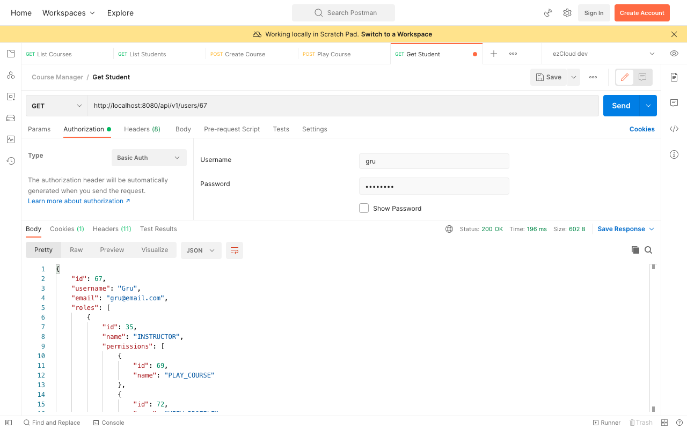
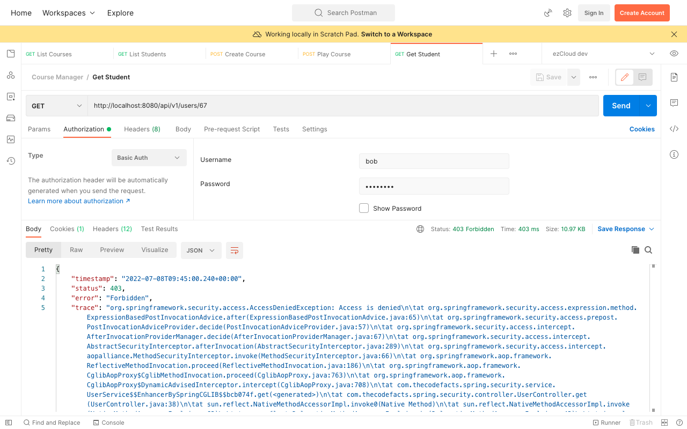

# Method Security Annotation - PostAuthorize

`@PostAuthorize` is very similar to `@PreAuthorize` with the only difference that it checks the given expression after the execution of the method. So we get access to the return value of the method to make the authorization decision using the SpEL expression inside `@PostAutorize`.

Though we secured [View Profile](http://lcoalhost:8080/api/v1/users/%7BuserId%7D) API using `VIEW_PROFILE` permission, any authenticated user can view other user's profile because it is assigned to all the Roles.

As per the Security objective defined in [Chapter 1](https://github.com/SankaranarayananMurugan/spring-security-guide/tree/main/01.%20Introduction), we want the authenticated user to view only his profile. In order to achieve this, we have access to the current authenticated user from the `Authentication` object stored in the `SecurityContext` (Refer [Chapter 9](https://github.com/SankaranarayananMurugan/spring-security-guide/tree/main/09.%20Current%20Authenticated%20User)). Our job is to match it with the requested user profile, which is quite not possible before entering the method only with the `{userId}`.

However we can do the same after the execution of the method using the `returnObject`, a built-in expression to access the return value of the method. Similarly we can access the `Authentication` object using `authentication` built-in expression. Now the `@PostAuthorize` syntax looks like below:

```
@PreAuthorize(Authority.VIEW_PROFILE)  
@PostAuthorize("returnObject.username == authentication.name")  
public AppUser get(Long userId) {  
    return appUserRepository.findById(userId)  
            .orElse(null);  
}
```

Restart the application and send [View Profile](http://lcoalhost:8080/api/v1/users/%7BuserId%7D) request to view `Gru` profile using `Gru`, we will get the `AppUser` details in the response.



Similarly send another request to view `Gru` profile using `Bob`, we will get `403 Forbidden` error.

