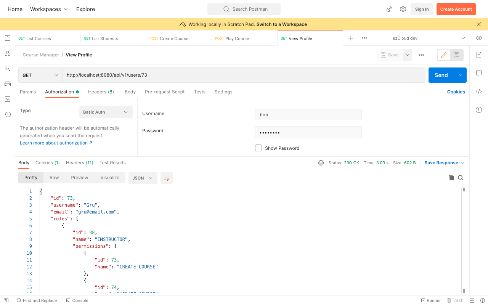
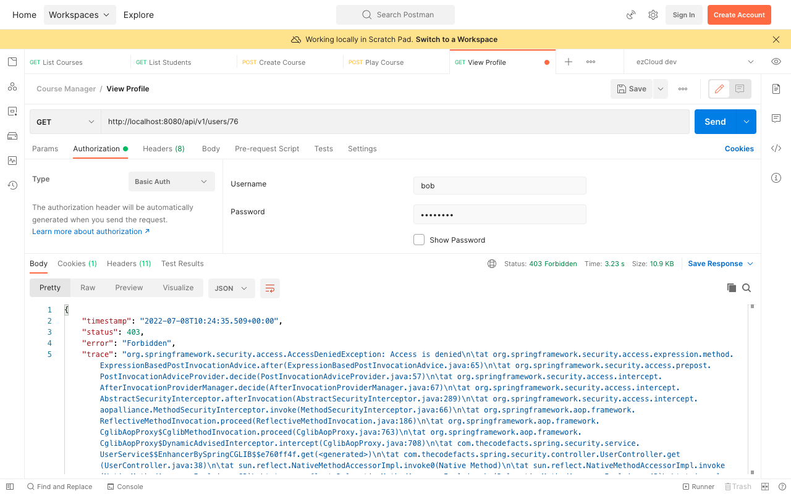

# Method Security Annotation - Spring Bean

Simple authorization rules can be written using SpEL expressions inside Method security annotations. But there can be rules which are quite harder to write/understand in SpEL, where the expression itself could be better off reside in its own method rather than as a complex String constant.

Let's extend the last use case to make Instructor's profiles public in addition to viewing one's own profile. This can only be done by checking if the requested user profile has Instructor role.

```java
appuser.getRoles()  
    .stream()  
    .anyMatch(appRole ->  
            appRole.getName().equals(RoleEnum.INSTRUCTOR)  
    );
```

Is there any simpler way to implement this in SpEL expressions? Well, we can do this using Spring Beans. Define a  `@Component` class named as `ServiceSecurity` to hold a collection of helper methods to secure your Service layer.

```java
@Component("serviceSecurity")  
public class ServiceSecurity {
    public Boolean isInstructor(AppUser appUser) {
        ...
    }
}
```

Call the method `ServiceSecurity.isInstructor()` with the `AppUser` object using `returnObject` expression inside `@PostAuthorize`, along with the existing expression using an `or` condition.

```java
@PreAuthorize(Authority.VIEW_PROFILE)  
@PostAuthorize("@serviceSecurity.isInstructor(returnObject) or returnObject.username == authentication.name")  
public AppUser get(Long userId) {  
    ...
}
```

Now send a [View Profile](http://localhost:8080/api/v1/users/%7BuserId%7D) request for *Gru* (Instructor) using `Bob` (Student), we will be authorized to access the Instructor's profile.



Whereas the same request for another student say *Kevin* will fail with `403 Forbidden` error.



***

Previous: [15. Method Security - PostAuthorize](https://github.com/SankaranarayananMurugan/spring-security-guide/tree/main/15.%20Method%20Security%20-%20PostAuthorize)

Next: [17. Domain Object Instance Security - SpEL expressions](https://github.com/SankaranarayananMurugan/spring-security-guide/tree/main/17.%20Domain%20Object%20Instance%20Security%20-%20SpEL%20expressions)