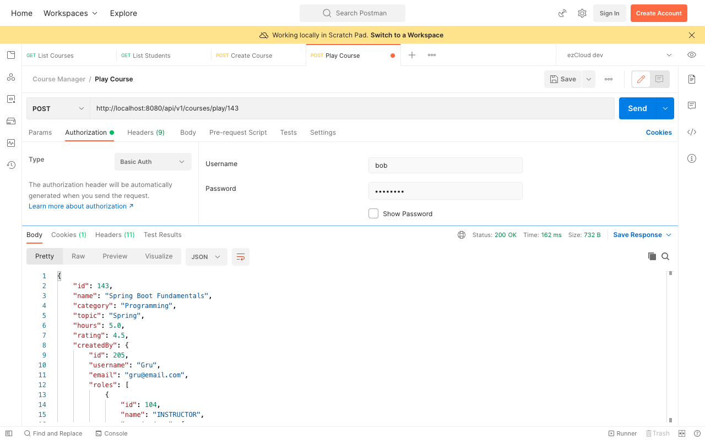
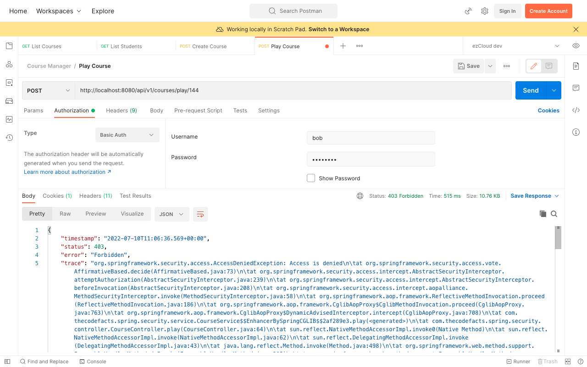

# Domain Object Instance Security - PermissionEvaluator interface

We said `PermissionEvaluator` interface is intended to be the bridge between SpEL and Spring Security's ACL system, but it has no hard dependencies to only use ACL module. So we can swap Spring Security's ACL implementation with our own implementation to define ABAC policies.

Let's define a class named `CoursePermissionEvaluator` and implement the `PermissionEvaluator` interface by overriding the two `hasPermission()` methods. It is always better to implement both the methods, by finding the `targetDomainObject` in the method which receives only `targetId` and `targetType`, and call the other `hasPermission()` which receives the `targetDomainObject`.

```java
@Component
public class CoursePermissionEvaluator implements PermissionEvaluator {  
	@Override  
	public boolean hasPermission(Authentication authentication, Object targetDomainObject, Object permission) {  
		if (targetDomainObject != null) {  
			Course course = (Course) targetDomainObject;  
			PermissionEnum permissionEnum = PermissionEnum.valueOf((String) permission);  

			switch(permissionEnum) {  
				case UPDATE_COURSE:  
					return this.isCreatedBy(authentication, course);  
				case PLAY_COURSE:  
					return this.isEnrolledStudent(authentication, course.getId());  
			}  
		}  
		return false;  
	}  

	@Override  
	public boolean hasPermission(Authentication authentication, Serializable targetId, String targetType, Object permission) {  
		if (targetId != null) {  
			Long courseId = (Long) targetId;  
			Optional<Course> course = courseRepository.findById(courseId);  
			if (course.isPresent()) {  
				return this.hasPermission(authentication, course.get(), permission);  
			}  
		}  
		return false;  
	}
}
```

By this way we can have the decision makers in only one method. Still we can call any `hasPermission()` in the SpEL expression based on the information we have on the method signature.

We can move the decision making logic for each permission in its own private method we already defined in the previous chapter for `ServiceSecurity`

```java
// Check if the requested course is created by the authenticated user.  
private boolean isCreatedBy(Authentication authentication, Course course) {  
	return course.getCreatedBy().getUsername().equalsIgnoreCase(authentication.getName());  
}
```

```java
// Check if the requested course is enrolled by the authenticated user.  
private boolean isEnrolledStudent(Authentication authentication, Long courseId) {  
	Optional<AppUser> student = appUserRepository.findByUsername(authentication.getName());  
	if (student.isPresent()) {  
		return student.get()  
			.getEnrolledCourses()  
			.stream()  
			.anyMatch(course -> course.getId().equals(courseId));  
	}  
	return false;  
}
```

Though we annotated the *CoursePermissionEvaluator* as a Component, Spring Security will not be aware of any `PermissionEvaluator` implementation. We have to explicitly register it with `DefaultMethodSecurityExpressionHandler` by extending `GlobalMethodSecurityConfiguration` class and overriding it's `createExpressionHandler()` method. Let's also move `@EnableGobalMethodSecurity` to this new `SecurityConfig` as it will be more appropriate.

```java
@Configuration  
@EnableGlobalMethodSecurity(prePostEnabled = true)  
public class SecurityConfig extends GlobalMethodSecurityConfiguration {  
	@Autowired  
	private CoursePermissionEvaluator coursePermissionEvaluator;  

	@Override  
	protected MethodSecurityExpressionHandler createExpressionHandler() {  
		DefaultMethodSecurityExpressionHandler defaultMethodSecurityExpressionHandler  
				= new DefaultMethodSecurityExpressionHandler();  
		defaultMethodSecurityExpressionHandler.setPermissionEvaluator(coursePermissionEvaluator);  
		return defaultMethodSecurityExpressionHandler;  
	}  
}
```

Everything is now wired up to test the `PermissionEvaluator` implementation. Sending a Play Course or Update Course API request reaches the respective Service method only after evaluating `hasPermission()` SpEL expression for the requested `courseId` using `CoursePermissionEvaluator` class.

Send a [Play Course](http://localhost:8080/api/v1/courses/play/%7BcourseId%7D) request as `Bob` (Student) for one of the courses enrolled by him, and you will get the course details as below:



Send another request with the same user for any course not enrolled by him, and you will get `403 Forbidden` error

