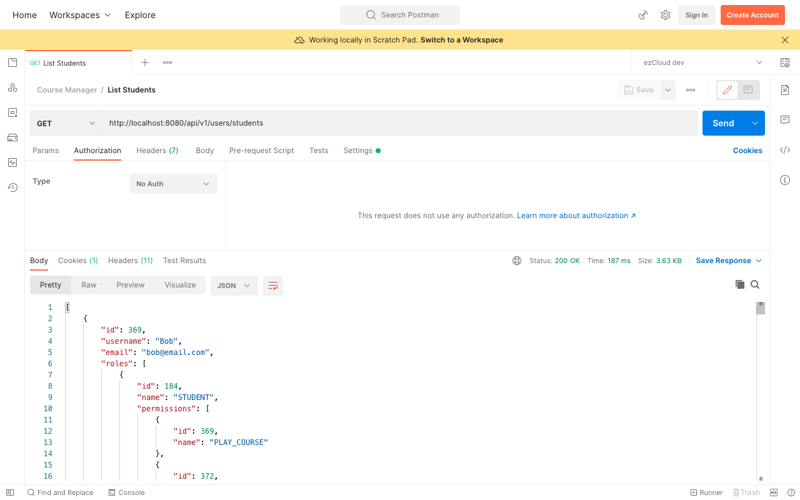
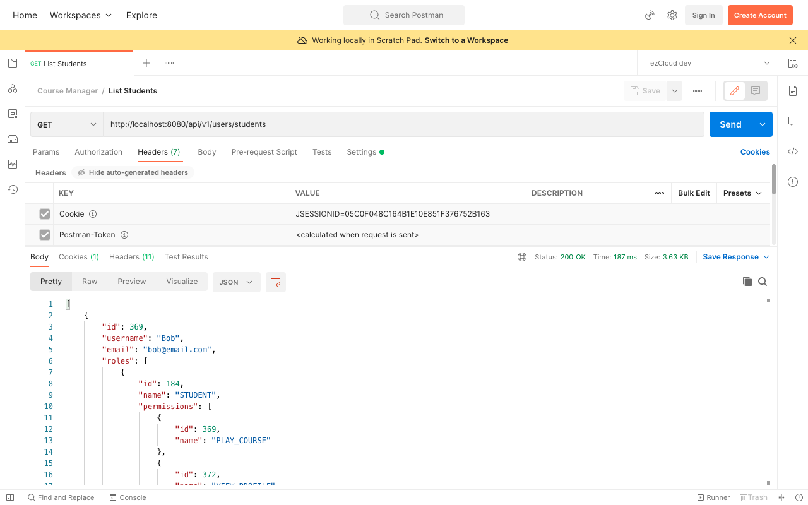

# Basic Authentication Revisited

Let's send a request to [List Students](http://localhost:8080/api/v1/users/students) API using Postman with Admin user credentials in Basic Auth. Once we get the success response, change the Type of Authorization from Basic to No Auth and send the request again. Surprisingly we get a success response though we did not send Admin user credentials the second time.



This is because of the user session created in the first request. By default Spring Security creates a HttpSession and attach the JSESSIONID as cookie in the response. This cookie is sent back on subsequent requests to identify the user without the need to send username and password on those requests.



While we said Basic Auth is stateless where each request must contain username and password, but nothing stops you from making it stateful by creating a HttpSession for the requested user. Alternatively we can say, it is designed to be stateless when we disable the Cookies (Turn ON Disable cookie jar option in Request settings in Postman) in our user agent. We can also override the Spring Security's default behaviour by configuring `sessionManagement` in `HttpSession` to make it stateless like below.

```
http  
    .csrf().disable()  
    .sessionManagement(  
        httpSecuritySessionManagementConfigurer ->  
            httpSecuritySessionManagementConfigurer.sessionCreationPolicy(SessionCreationPolicy.STATELESS)  
    )  
    .authorizeRequests(auth -> auth  
        .antMatchers(GET, PUBLIC_API_LIST).permitAll()  
        .anyRequest().authenticated()  
    )  
    .httpBasic();  
return http.build();
```

### Stateless Basic Auth
The problem with Basic Auth being stateless is the user does not have the option to login or logout. As a result they have to get them identified repeatedly on every request with their username and password. This will not be a nice user experience for the web applications. And having the user credentials in transit for a number of times poses serious security threats.

As these credentials are merely Base64 encoded, and not encrypted, Basic Auth is typically used in conjunction with HTTPS to provide confidentiality. Having said that Basic Auth might suit machine to machine interactions provided the credentials are stored and transferred securely over HTTPS, however it is not suitable for most of the scenarios for the drawbacks mentioned above.

### Stateful Basic Auth
Basic Auth over HTTPS with Cookies and Sessions enabled resolves most of the above issues and is still a good choice for some of the use cases. Also Spring Security provides out of the box support to Session management with no extra code as we saw from its default behaviour before making it Stateless in this chapter. But one should be aware of some of the issues inherent to Session.

### Session and its drawback
Sessions are kind of datastore in server, created uniquely for each user to identify them, store different attributes  specific to the user and make them available across multiple requests. Sessions are highly prone to scalability issues where a Session created in one instance will not be available in other instances when we are running multiple instances of the application.

### Spring Session
Spring Session - a container independent solution - can be used to support such clustered sessions without being tied to a specific instance. This can be most suitable when we have multiple instances of homogeneous (same monolithic) applications sharing the same datastore.

However the concept of User Session itself does not go well with Microservice style architecture where we can have multiple instances of heterogeneous applications/services. Each service can have its own datastore and the choice of storage system can also differ.

The way to go forward with Session-free authentication and with no need for sending username and password on every request is Token Based Authentication.