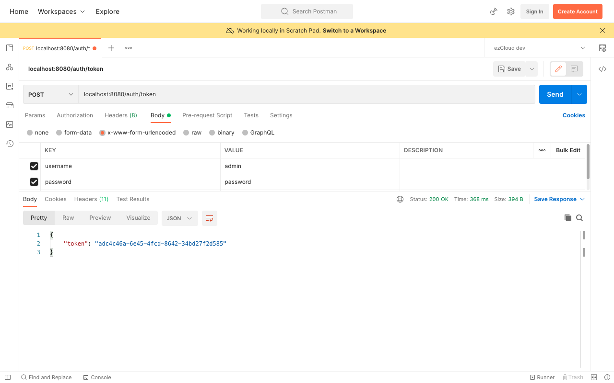

# Token Based Authentication

Tokens are always better than username/password as they are uniquely generated on each login. And they do not hang around for a long time as they are invalidated either when the user logout or when it reaches its expiry time.

Token-based auth requires the user to provide username/password only once during login. It then generates a unique token (generally a random string) for the user on successful authentication. This unique token can be sent on subsequent requests to identify the user until the token expires or invalidated.

But using tokens requires a bit of learning curve on how to generate, verify and invalidate them which is not the case with Basic Auth. We will implement token-based authentication mechanism in this section using our own token of random string (say UUID).

JSON Web Token (JWT) is an open, industry standard token specification widely popular for many reasons. But we will implement and understand how token-based authentication mechanism works and then we will replace our token with JWT using battle-tested production grade JWT library.

First we will create `AuthenticationService` component and implement a method `generateToken()` accepting *username* and *password*.

```java
@Service  
public class AuthenticationService {
    public String generateToken(String username, String password) {
        // Authenticate using Spring Security's AuthenticationManager with username/password
        // Generate and return token if authentication success
    }
}
```

We are not going to perform authentication ourselves by checking the existence of username and password in the database. Spring Security provides `AuthenticationManager` interface having only one method `authenticate()` which accepts and returns `Authentication` object. Remember `Authentication` object we retrieved earlier from `SecurityContext` inside `AuthenticationFacade` class which represented the current authenticated user.

We will use `UsernamePasswordAuthenticationToken` class to create an unauthenticated `Authentication` object with the *username* & *password* and authenticate it using `AuthenticationManager`. It will then internally call our `DbUserDetailsService` to load the user by his username, authenticate him using the given password and returns the authenticated `Authentication` object. We will then return the UUID token if the authentication is success.

```java
@Autowired
private AuthenticationManager authenticationManager;

public String generateToken(String username, String password) {
    Authentication authentication = UsernamePasswordAuthenticationToken.unauthenticated(username, password);
    authentication = authenticationManager.authenticate(authentication);
    
    String token = null;  
    if (authentication.isAuthenticated()) {
        token = UUID.randomUUID().toString();
    }
    
    return token;  
}  
```

By default `AuthenticationManager` is not exposed as a bean, we have to expose it by getting it from `AuthenticationConfiguration` in `SecurityConfig` as below:

```java
@Bean  
public AuthenticationManager authenticationManager(AuthenticationConfiguration authenticationConfiguration) throws Exception {  
    return authenticationConfiguration.getAuthenticationManager();  
}
```

Now create an REST API to return the generated token from `AuthenticationService` as below:

```java
@RestController  
@RequestMapping("auth")  
public class AuthenticationController {  
    @Autowired  
    private AuthenticationService authenticationService;  
    
    @PostMapping(path = "token", consumes = {APPLICATION_FORM_URLENCODED_VALUE}) 
    public ResponseEntity<Map<String,String>> generateToken(@RequestParam("username") String username,  
                                @RequestParam("password") String password) {  
        String token = authenticationService.generateToken(username, password);  
        Map<String, String> tokenResponse = Collections.singletonMap("token", token);  
        return ResponseEntity.ok(tokenResponse);  
  }
}
```

Finally we have to configure this API to be accessible for all. Let's create a constant for the API URL in `SecurityConstants`.

```java
public static final String API_AUTH_TOKEN = "/auth/token";
```

Then permit the API for all in the `ApiSecurityConfig` and remove `httpBasic()`.
```java
http  
    .csrf().disable()  
    .sessionManagement(  
            httpSecuritySessionManagementConfigurer ->  
                    httpSecuritySessionManagementConfigurer.sessionCreationPolicy(SessionCreationPolicy.STATELESS)  
    )  
    .authorizeRequests(auth -> auth  
            .antMatchers(POST, API_AUTH_TOKEN).permitAll()  
            .antMatchers(GET, PUBLIC_API_LIST).permitAll()  
            .anyRequest().authenticated()  
    );
```

Let's submit an API request to generate token from Postman for the user *Admin* using his credentials in `x-www-form-urlencoded` body type like below



Remember we removed `httpBasic()` because of which all the protected APIs will not be accessible even for the right users. This is because Spring Security could not identify the user at this stage, as we are yet to verify the token and tell Spring Security who the user is and what are they allowed to do. But before verifying the token we have to associate the token with the user who requested it and store it somewhere to verify it on each requests.