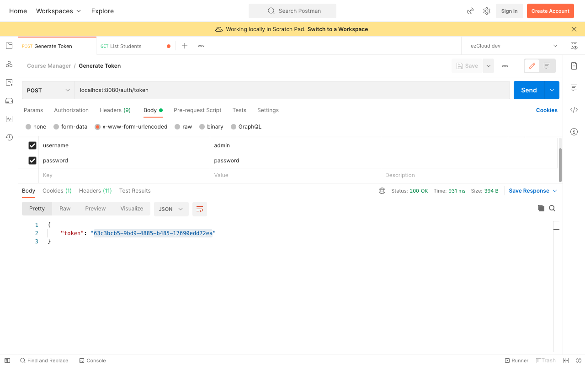
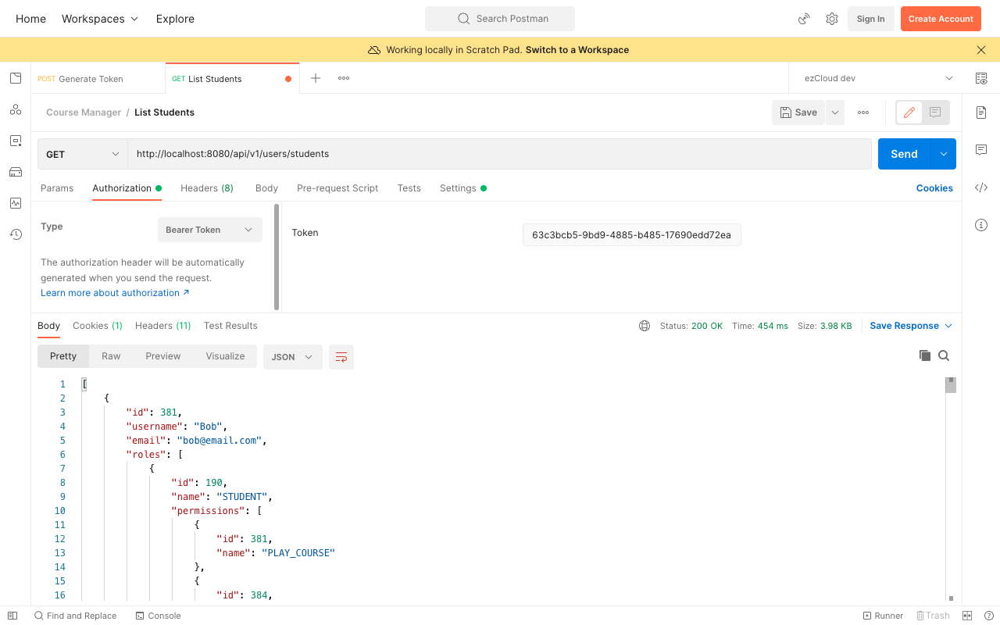

# Token Based Authentication - Verify Token

Assume we have a Single Page Application (SPA) calling our GenerateToken API on behalf of the user with the username and password provided by the user himself. Once our service authenticates and issues the token, the SPA will store the token somewhere to send it back in subsequent requests as a Bearer token in the `Authorization` header in the format `Bearer <TOKEN>`.

Bearer token is a security token similar to cash, whoever possess the token can use it in any way the token is intended for. Using a bearer token does not require a bearer to prove the possession of the token. So it must be stored securely and transferred over a secure network.

In order to verify the token, we need to identify the user associated with the token as well as ensure the token is not expired. Let's add below Spring Data JPA standard method in `AppUserRepository` to get the `AppUser` by token and tokenExpiryTime greater than the given time.

```java
@Repository
public interface AppUserRepository extends JpaRepository<AppUser, Long> {
    // Other methods omitted for brevity	
    Optional<AppUser> findByTokenAndTokenExpiryTimeGreaterThan(String token, Date currentDate);
}
```

Create a method by name `loadUserByToken()` in `DbUserDetailsService` similar to `loadUserByUsername()` and call the above `AppUserRepository` method to get the `AppUser` by token. In order to ensure we get the `AppUser` record having the unexpired token, we will pass current time to check it against the tokenExpiryTime.

```java
public UserDetails loadUserByToken(String token) throws UsernameNotFoundException {  
    AppUser appUser = appUserRepository.findByTokenAndTokenExpiryTimeGreaterThan(token, new Date())  
            .orElseThrow(() -> new BadCredentialsException("Provided token is either expired or not found"));  
    
    return User.builder()  
        .username(appUser.getUsername())  
        .password(appUser.getPassword())  
        .authorities(this.getPermissions(appUser.getRoles()))  
        .build();  
}
```

Before the request reaches the endpoint we have to get the Bearer Token from the request header, identify the user using the token and make the `UserDetail` available for Spring Security to authorize the user until the request completes. In order to achieve this, we can implement a filter component extending Spring's `OncePerRequestFilter`.

```java
@Component  
public class TokenVerificationFilter extends OncePerRequestFilter {
    @Override  
    protected void doFilterInternal(HttpServletRequest request, HttpServletResponse response, FilterChain filterChain) throws ServletException, IOException {
        // Extract the token
        // Identify the user
        // Create authenticated Authentication
        // Set Authentication in SecurityContext
        filterChain.doFilter(request, response);
    }
}
```

The format of the `Authorization` header value will be `Bearer <TOKEN>`, so we have to remove the prefix `Bearer ` to get the token value only. We will then use the extracted token to get the `UserDetail` by calling `loadUserByToken()` in `DbUserDetailsService` component. We will create the authenticated `Authentication` object using `UsernamePasswordAuthenticationToken` class and set it in `SecurityContext` using `AuthenticationFacade` component.

```java
String authorizationHeader = request.getHeader(HttpHeaders.AUTHORIZATION);  
  
if (authorizationHeader != null && authorizationHeader.startsWith("Bearer ")) {  
    // Extract the token
    String token = authorizationHeader.replace("Bearer ", "");  
    // Identify the user
    UserDetails userDetails = userDetailsService.loadUserByToken(token);  
    
    if (userDetails != null) {  
        // Create authenticated Authentication
        Authentication authentication = UsernamePasswordAuthenticationToken.authenticated(  
                userDetails.getUsername(), null, userDetails.getAuthorities()  
        );  
        // Set Authentication in SecurityContext
        authenticationFacade.setAuthentication(authentication);  
    }
}
```

> **Note**  
> While authenticating the user and generating the token, we created unauthenticated `Authentication` object using only *username* and *password*. Please note while verifying the token and identifying the user we must create authenticated `Authentication` object using *username* and *authorities*. Spring Security uses this `Authentication` object from `SecurityContext` while evaluating authorization in all the three layers.

Finally we need to tell Spring Security to pass through this filter before attempting to authenticate to identify the user. This can be done autowiring the `TokenVerificationFilter` in `ApiSecurityConfig` and updating `HttpSecurity` configuration using `addFilterBefore()` as below:

```java
http  
    .csrf().disable()  
    .addFilterBefore(tokenVerificationFilter, UsernamePasswordAuthenticationFilter.class)  
    .sessionManagement(  
            httpSecuritySessionManagementConfigurer ->  
                    httpSecuritySessionManagementConfigurer.sessionCreationPolicy(SessionCreationPolicy.STATELESS)  
    )  
    .authorizeRequests(auth -> auth  
            .antMatchers(POST, API_AUTH_TOKEN).permitAll()  
            .antMatchers(GET, PUBLIC_API_LIST).permitAll()  
            .anyRequest().authenticated()  
    );
```

Restart the application, send a POST request to GenerateToken API in Postman using *Admin* user credentials. And we do not need to choose any Authorization type. Once the authentication is success, we will get the token for the *Admin* user as below:



Now change the Authorization type to `Bearer Token` and provide the generated token for *Admin* user in the Token field, and send a GET request to List Students API to see the list of students the *Admin* user is authorized to see.



You can test the same for different users and their authorized actions. You can also use the token after it's expiry time to see `403 Forbidden` error which then requires you to re-authenticate the user to generate a new token.