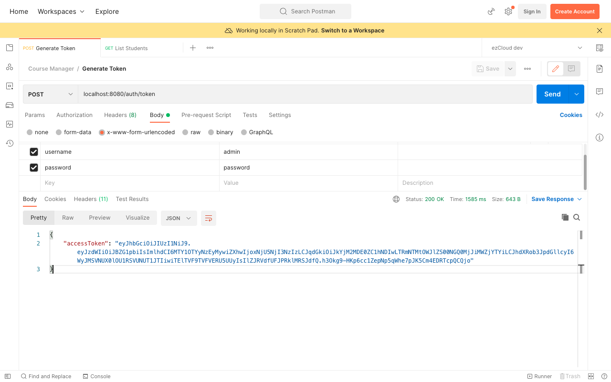
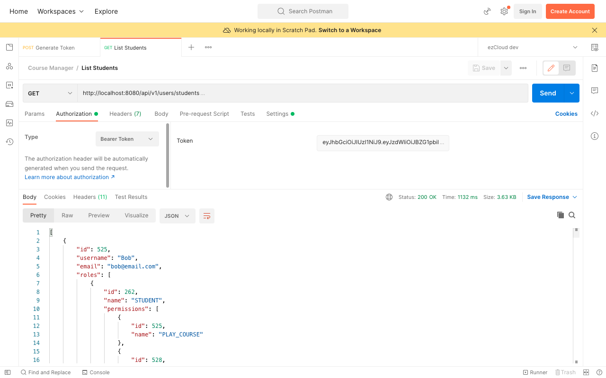

# JSON Web Token - Verify JWT

As JWT is self-contained, all we need is just to verify and parse the JWT using the `SecretKey` and construct the `Authentication` object back. We do not need to identify the user from database as we did for our opaque token earlier.

Let's remove `AppUser` identification from the database using our opaque token in `TokenVerificationFilter`. And replace it with below code:

```java
@Override  
protected void doFilterInternal(HttpServletRequest request, HttpServletResponse response, FilterChain filterChain) throws ServletException, IOException {
    String authorizationHeader = request.getHeader(HttpHeaders.AUTHORIZATION);

    if (authorizationHeader != null && authorizationHeader.startsWith("Bearer ")) {
        String accessToken = authorizationHeader.replace("Bearer ", "");
        // Parse JWT using the SecretKey
        Claims claims = Jwts.parserBuilder()
            .setSigningKey(jwtConfig.getSecretKey())
            .build()
            .parseClaimsJws(accessToken)
            .getBody();

        // Check if JWT has expired
        if (claims.getExpiration().after(new Date())) {
            Authentication authentication = UsernamePasswordAuthenticationToken.authenticated(
                    claims.getSubject(), null, this.getAuthorities(claims)
            );
            authenticationFacade.setAuthentication(authentication);
        }
    }

    filterChain.doFilter(request, response);
}

private List<GrantedAuthority> getAuthorities(Claims claims) {
    return ((List<String>) claims.get("authorities")).stream()
        .map(SimpleGrantedAuthority::new)
        .collect(Collectors.toList());
}
```

`Jwts` provides another Builder class `JwtParserBuilder` which accepts `SecretKey` while building `JwtParser` object. `parseClaimsJws()` uses the `SecretKey` to verify the signature and parse the content of JWT.

> **Note**
>
> You may notice another parser method `parseClaimsJwt()` in `JwtParser` which resembles `parseClaimsJws()`. But we are using the one which ends with *Jws* instead of *Jwt*. This is because signed JWT tokens are called JWS (not JWT), and in our case we want to parse the JWT which was signed with the `SecretKey`.

We will then get the body of the verified and parsed JWT. It has the information we saw earlier in the decoded payload data in the JWT official page. Now instead of identifying the user and his authorities from the database, we can get the same from the JWT payload.

Before using the username and his authorities from the token in order to construct the `Authentication` object, we have to check if the token has expired.

We can remove the `token` and `tokenExpiryTime` from the `AppUser` entity, as we are no more using it with JWT. Also we can do the following to tidy up some of the code related to opaque token which are no more relevant.

- Remove `invalidateToken()` from `AuthenticationController` and `AuthenticationService`
- Remove `deleteToken()` from `UserService`
- Remove pre-authorize condition defined for `deleteToken()` in `SecurityConstants`
- Remove `loadUserByToken()` from `DbUserDetailsService`
- Remove `findByTokenAndTokenExpiryTimeGreaterThan()` from `AppUserRepository`

Restart the application, and use the GenerateToken API to generate a new JWT token for *Admin* user. Copy and paste the accessToken in `Bearer` token field in Postman and send an API request to any protected resources Admin user can access, say ListStudents API.





Similarly you can test for all other protected resources for all the users with their tokens.